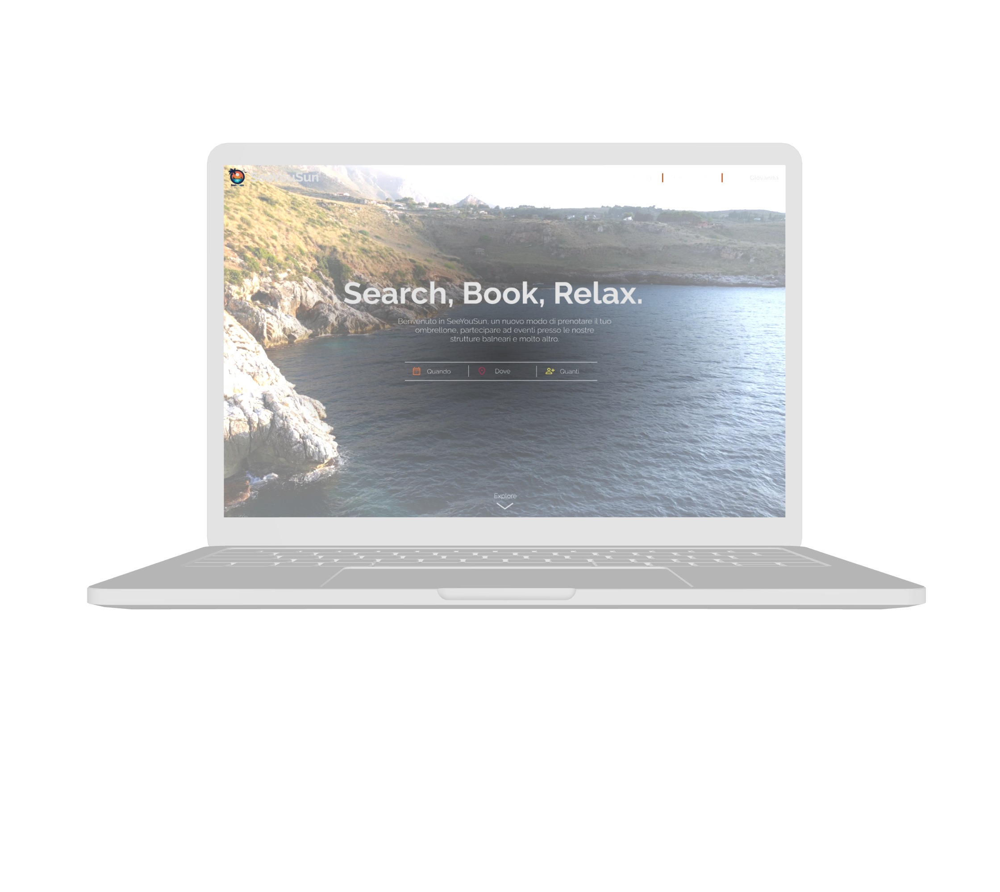
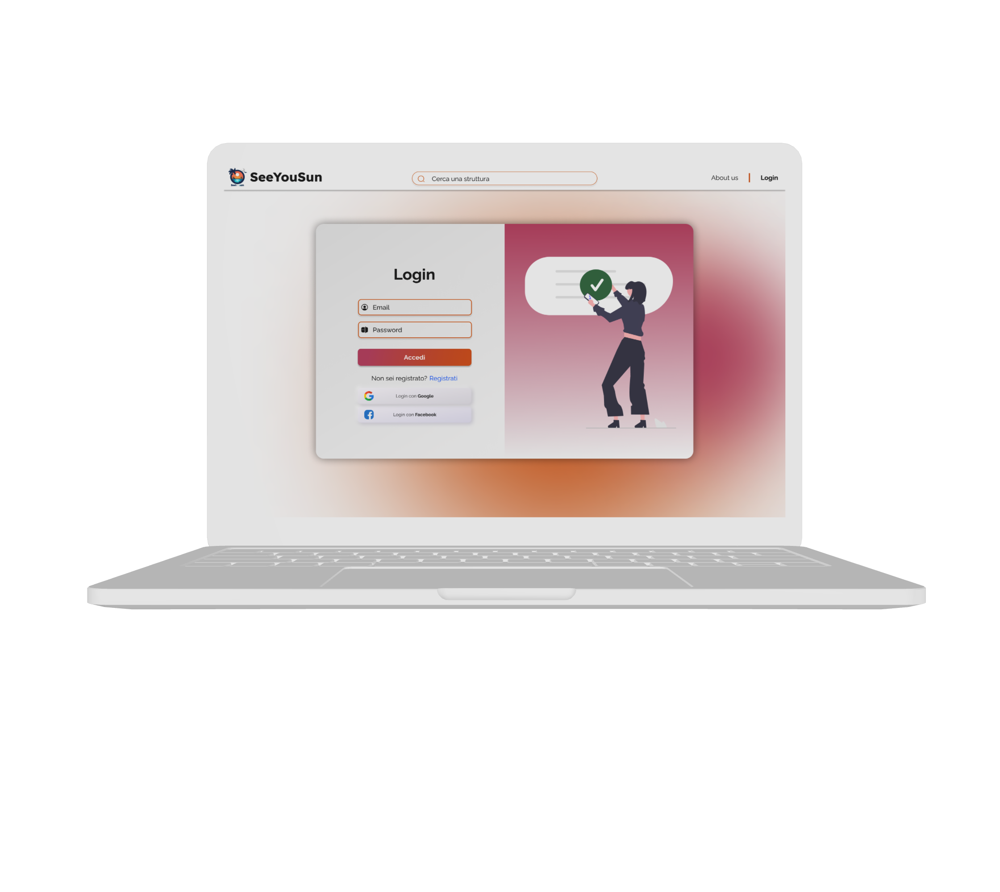
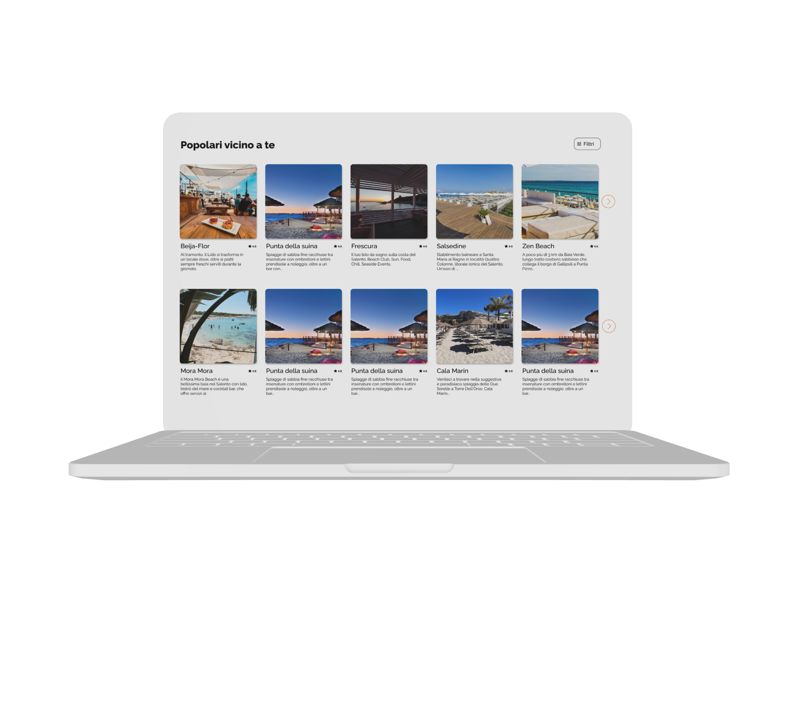
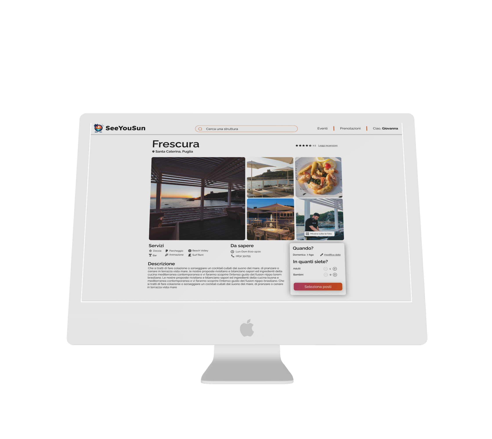
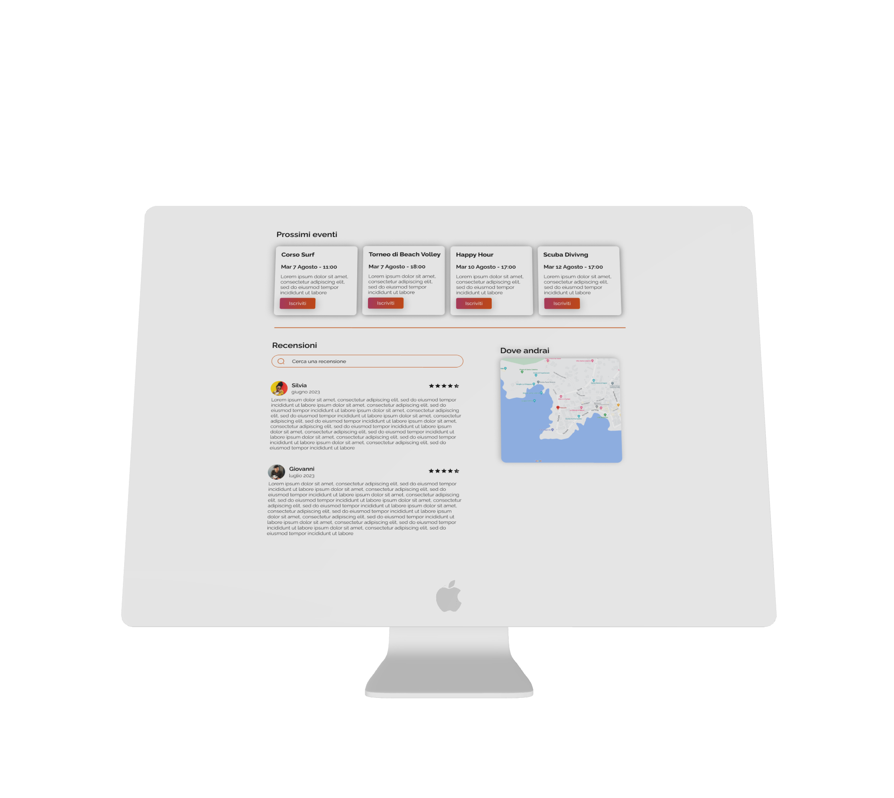
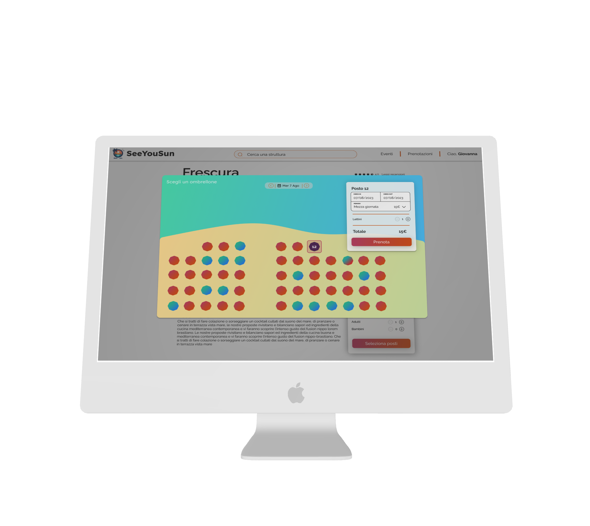
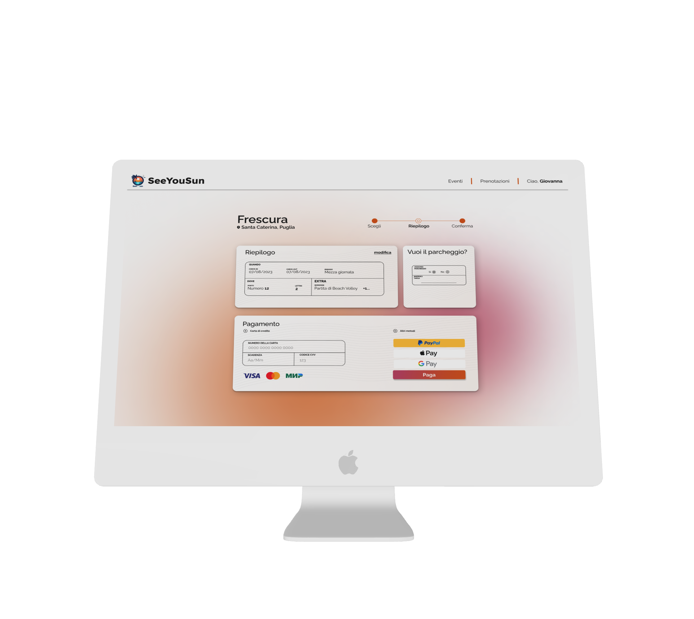

# SeeYouSun
## A new way to book your umbrella, participate in events at beach facilities, and much more.

**SeeYouSun** is a university project designed to simplify booking beach facilities such as umbrellas and sunbeds at seaside resorts. This application allows users to easily reserve spots at their preferred beach locations and offers additional features that enhance the beach experience.

## Project Description

SeeYouSun provides a new way to book your umbrella, join events at our beach facilities, and much more. With this application, users can:

- **Browse Upcoming Events**: Discover and register for events like surfing lessons, beach volleyball tournaments, happy hours, and more.
- **View Reviews**: Check out reviews from other users to make informed choices about where to book.
- **Map Integration**: See exactly where each beach facility is located to plan your day efficiently.
- **Make Reservations**: Choose specific spots on the beach for your umbrella and sunbed with a convenient and user-friendly booking interface.
- **Easy Payment Options**: Use different payment methods to finalize your bookings quickly and securely.

## Features

- **Intuitive Interface**: Users can navigate effortlessly through the booking and event selection processes.
- **Event Participation**: Sign up for various beach events directly through the app.
- **Personalized Experience**: Users can view facilities nearby and read detailed descriptions to find the perfect spot.
- **Responsive Design**: Optimized for both desktop and mobile, ensuring a seamless experience across devices.

---
